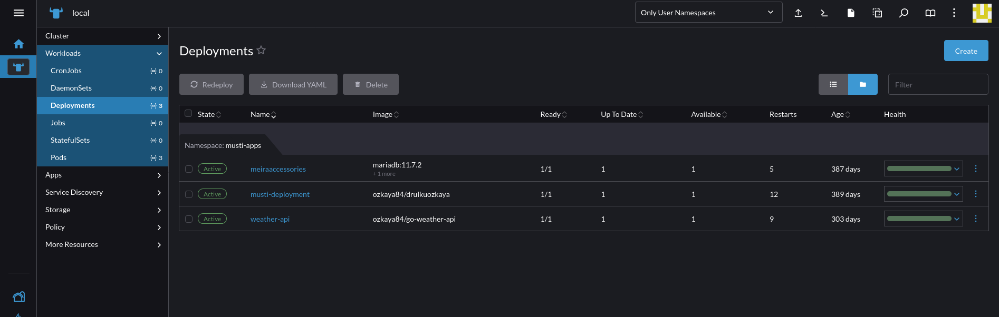
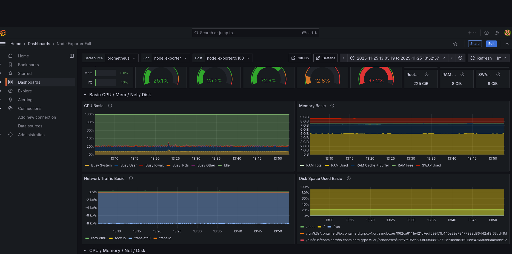

# Kubernetes Cluster Production Setup.

This repository contains production-ready Kubernetes configurations for a multi-application environment running on Rancher.

##  Applications Deployed

### 1. Meira Accessories
- **Type:** Web Application
- **Services:** Main service + NodePort for external access
- **Database:** MariaDB integration
- **Features:** Load balancing, external accessibility

### 2. Musti Deployment  
- **Type:** Web Application
- **Services:** ClusterIP + NodePort (port 30000)
- **Features:** Internal and external access patterns

### 3. Weather API
- **Type:** API Service (Go application)
- **Port:** 8080
- **Services:** ClusterIP + NodePort (port 30002)
- **Features:** REST API with health checks

### 4. Database Layer
- **MariaDB:** Relational database with dedicated service

### 5. Monitoring 
- **Prometheus** -- Data pollution
- **Grafana** -- Graphs 

## Architecture

Load Balancer (Traefik)
- ├── Meira Accessories (port 30001)
- ├── Musti App (port 30000)
- └── Weather API (port 30002)
- └── MariaDB Database

##  Technical Stack

- **Orchestration:** Kubernetes v1.28+
- **Management:** Rancher 2.9.3
- **Ingress:** Traefik
- **Service Mesh:** Built-in Kubernetes networking
- **Monitoring:** Resource limits and health checks

## Repository Structure

- kubernetes-production-setup/
- ├── manifests/ # Raw Kubernetes YAML files
- ├── helm-charts/ # Helm charts for each application
- ├── documentation/ # Architecture and runbooks
- └── scripts/ # Deployment and maintenance scripts

##  Quick Start

```bash
# Deploy all applications
kubectl apply -f manifests/

# Or use Helm charts
helm install meira-accessory ./helm-charts/web-app
helm install weather-api ./helm-charts/go-api-app

# Monitoring -- Docker Compose
cd ./manifests/monitoring/
docker-compose up 

```

## Rancher 


## Monitoring - Grafana
 
